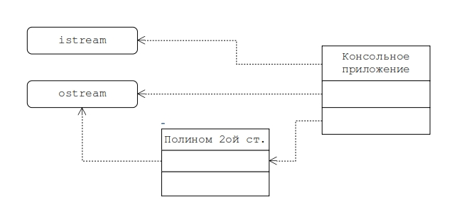

# Задание на практическую работу

Создать консольное приложение согласно представленной на рис. диаграмме классов, предназначенное для вычисления корней полинома 2-ой степени p(x) = a*x^2 + b*x + c (a≠0) и его значения для заданного аргумента х на множестве целых чисел. Для этого необходимо специфицировать пользовательские классы "Консольное приложение" и "Полином 2ой степени". Т.е. задать атрибуты и методы указанных классов и распределить их по существующим областям видимости.  Спецификация классов и реализация их методов должна обеспечивать реализацию отношений, указанных на диаграмме классов. В отчете представить аргументированное обоснование своего выбора.
Приложение должно включать основной модуль (функция `main`), модуль `application` и модуль `polinom`.
В основном модуле консольного приложения (для языка С++ — это модуль с функцией main) должен создаваться объект класса "Консольное приложение" и вызываться его метод, который предоставляет пользователю меню команд приложения.
Модуль `application` должен содержать спецификацию класса "Консольное приложение" и реализацию его методов. Один из методов должен реализовывать меню команд приложения, включающее:
- команду, инициирующую ввод коэффициентов `a, b, c` (до ввода должны быть заданы значения по умолчанию);
- команду, инициирующую расчета корней полинома и вывод результатов расчета;
- команду, инициирующую ввод значения аргумента `х` (по умолчанию равен 0), расчет значения и его вывод;
- команду, инициирующую вывод текстового представления полинома в указанной форме `p(x)`;
- команду, инициирующую вывод текстового представления полинома в канонической форме;
- команду выхода из приложения.

Модуль `polinom` должен содержать спецификацию класса "Полином 2ой степени" и реализацию его методов, необходимых для реализации цели разрабатываемого приложения. Описание класса должно использовать вместо типа double (вещественное число, заданное в условии) абстрактный тип number, описание которого должно задаваться в отдельном заголовочном файле `number.h` с помощью оператора `typedef int number` (для С++).
Требуется реализовать и отладить программу, удовлетворяющую сформулированным требованиям и заявленным целям. Разработать контрольные примеры и оттестировать на них программу. Оформить отчет, сделать выводы по работе.

*Следует обратить внимание на то, что класс "Полином 2ой степени", используемый в работах №1-№4, один и тот же, что является одним из правил ООП - понятие, описываемое как класс должно использоваться многократно и без изменений, если не требуется дополнительной детализации понятия и/или усиления его функциональности.
