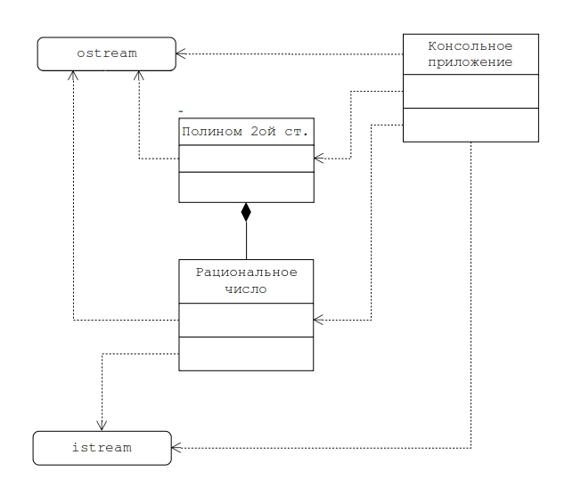

# Задание на практическую работу



Создать консольное приложение, реализующее функции перечисленные в описании работы №1 (вычисление корней, вычисление значения, представление полинома в классической и канонических формах) на множестве рациональных чисел.
	
Рациональное число - это несократимая дробь `a/b`, где `a` и `b` целые, причем `b > 0`.

Приложение должно включать основной модуль, модуль «application», модуль «polinom» и модуль «rational».

Для этого в проект лабораторной работы №1 следует добавить модуль с описанием и реализацией класса рациональных чисел `Rational`. Класс `Rational` должен быть встроен в проект согласно диаграмме классов на рис. При этом основной модуль, модуль `application` и модуль `polinom` не должны изменяться. Изменения вносятся лишь в заголовочный файл `number.h`, где

```cpp
typedef int number;
```
	
следует заменить на

```cpp
#include «rational.h»
typedef Rational number;
```
	
В классе `Rational` следует определить только те члены класса и спецификации, которые необходимы для совместимости модулей проекта и реализации отношений, приведенных в ДК объектной модели.

Реализовать и отладить программу, удовлетворяющую сформулированным требованиям и заявленной цели. Разработать контрольные примеры и оттестировать на них программу.

Программа оттестирована на полинме с коэффициентами
```bash
a = 2/5
b = 4/5
c = 112/405
```