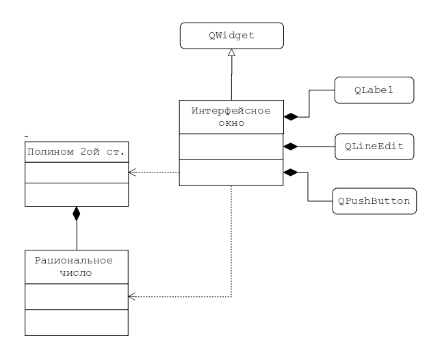

# Задание на практическую работу



Создать GUI приложение, реализующее функции перечисленные в описании работы №1 (вычисление корней, вычисление значения, представление полинома в классической и канонических формах) на множестве рациональных чисел. Приложение должно включать основной модуль, модуль `Interface`, модуль `Polinom` и модуль `Rational`.
Основной модуль `main.cpp` GUI приложения может иметь вид:

```C++
#include <QApplication>
#include "interface.h"

int main (int argc, char *argv[])
{
    QApplication a (argc, argv);
    TInterface interface;
    interface.show();
    return a.exec();
}
```

Реализовать и отладить программу, удовлетворяющую сформулированным требованиям и заявленным целям. Разработать контрольные примеры и оттестировать на них программу. Оформить отчет, сделать выводы по работе.