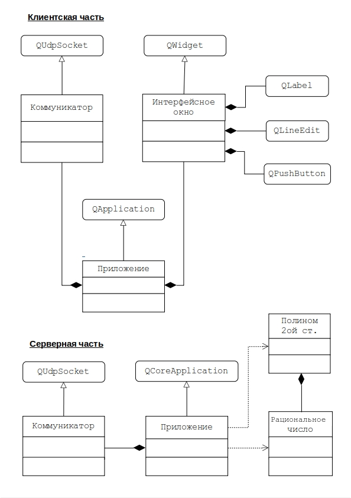

# Задание на практическую работу

Реализованные отношения зависимости, где интерфейс (отдельный модуль) выступает в качестве клиента зависимости, а полином и рациональное число (также отдельные модули) - в качестве источников зависимости, позволяют легко провести водораздел.

### Почему так можно и что это дает? 

Все дело в том, что среди атрибутов класса интерфейса нет таких, которые бы имели тип классов полинома и рационального числа. Этого нельзя сказать, например, о классe полинома и рационального числа, находящихся в отношении "композиция". Среди атрибутов класса полином есть тип рационального числа (`number`).

Проведение такого водораздела позволяет перейти от одного приложения к распределенному, в котором интерфейс входит в состав приложения-клиента, а классы источники зависимости обеспечивают главную функциональность приложения-сервера.

Приложения клиент и сервер могут работать на как одном, так и на разных хостах в локальной сети. Протокол сетевого взаимодействия задает область применения приложений. Так протокол `UDP` (реализуется в данной работе) ориентирован на взаимодействие `peer-to-peer` (точка-точка). Протокол `TCP` - на классическую архитектуру 1 сервер - множество независимых клиентов.

### Какие функции добавляются в клиентское и серверный части распределенного приложения работы 4? 

Клиентское приложение должно выполнять следующие функции:

- по-прежнему - ввод/вывод через интерфейсные элементы объекта класса интерфейс;
- не прямое обращение объекта интерфейс к объектам полинома и рационального числа, а формирование сообщения, состоящего из вида запроса (что от них надо) и параметров запроса (какие данные для этого есть);
- получать ответ на запрос не напрямую, а опять-таки через ответное сообщение;
- транслировать сообщения объекта интерфейс в сеть и обратно (новая функция).

Первые 3 функции естественно возложить на интерфейс. С чем работают интерфейсные объекты? В основном с текстовой информацией. Поэтому естественно формировать и принимать сообщения в строковом виде, не вдаваясь в особенности работы объекта сетевого коммуникатора, на которого должна быть возложена последняя функция. Вообще о коммуникаторе интерфейс знать не обязан, может быть обмен вообще не сетевой, а,скажем, через общую межпроцессную память, организованную операционной системой, и т.п. Поэтому в приложении-клиенте организующую роль должен играть объект класса приложение, основная функция которого - это преобразование сообщений от интерфейса в сообщения, потребляемыми коммуникатором, и наоборот. В эту же концепцию вкладывается обеспечение скрытности сетевого обмена, когда в процессе преобразования сообщений объект приложение выполняет тот или иной алгоритм шифрования/дешифрования. О нем точно не должны знать ни интерфейс, ни коммуникатор.

Серверое приложение должно выполнять следующие функции:

- получать и принимать сообщения из сети (коммуникатор);
- преобразовывать полученные сообщения к виду, позволяющему обращаться к объектам полинома и рационального числа;
- напрямую обращаться с запросами к объектам полинома и рационального числа, что в едином приложении выполнялось в реализации методов объекта интерфейс;
- получать ответ от полинома;
- преобразовывать его в ответное сообщение для интерфейса клиентского приложения.

Если функция преобразования сообщений в сеть и из сети в другой формат в клиенте возлагается на методы класса приложение, то и здесь нет причин от этого отказываться. 

Нужно ли использовать еще какой-то класс кроме необходимого для сервера класса приложения? В общем такой необходимости нет.

В какой формат и из какого преобразовывать сетевые сообщения? Поскольку обращение к полиному в едином приложение происходило из интерфейсного объекта и потребитель - также интерфейсный объект, но уже у клиента, то естественно применять общий формат в обоих приложениях. Общие функции следует реализовать в модуле, включаемом в оба приложения.

Клиент и сервер настроены на исполнение на одном компьютере по `IP` адресу `127.0.0.1` с перекрестным соединением портов `10000 -> 10001` и `10001 <- 10000`.
