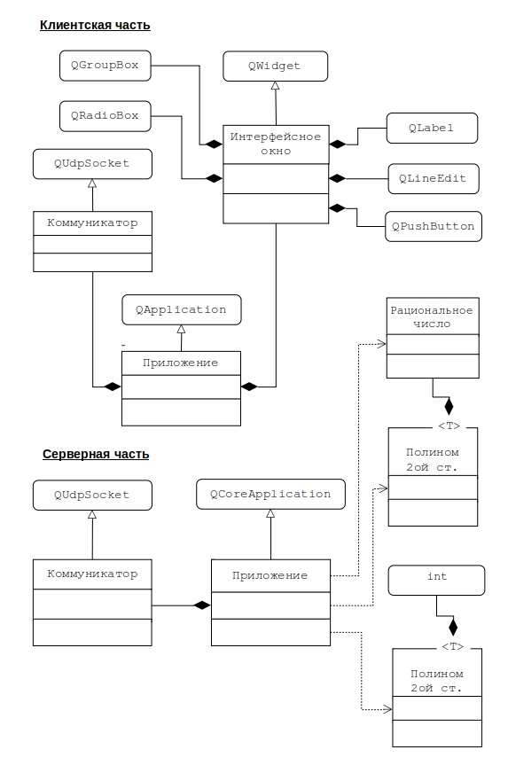

# Задание на практическую работу

Создать распределенное приложение, включающее клиентскую и сер-верную части, взаимодействующие посредством сетевого обмена сообщениями.

Клиентская часть представляет собой GUI приложение, реализующее интерфейс аналогичный работе №3.
Серверная часть представляет собой консольное приложение, предна-значенное для вычисления корней, значения и представления полинома 2-ой степени в классической и канонической формах на множествах вещественных и рациональных чисел. Для этого следует модифицировать описание класса `Polinom`, представив его в виде параметризованного класса с параметром `number`, который может принимать значения как `int`, так и `Rational`.

Клиентское приложение (GUI приложение) должно выполнять следую-щие функции:
- ввод/вывод через интерфейсные элементы объекта класса интерфейс;
- формирование сообщения, состоящего из вида запроса (что от них надо) и параметров запроса (какие данные для этого есть);
- получать ответ на запрос не напрямую, а через ответное сообщение;
- транслировать сообщения объекта интерфейс в сеть и обратно.

Серверное приложение (консольное приложение) должно выполнять следующие функции:
-	получать и принимать сообщения из сети (коммуникатор);
-	преобразовывать полученные сообщения к виду, позволяющему об-ращаться к объектам полинома и рационального числа;
-	напрямую обращаться с запросами к объектам полинома и рацио-нального числа, что в едином приложении выполнялось в реализации мето-дов объекта интерфейс;
-	получать ответ от полинома;
-	преобразовывать его в ответное сообщение для интерфейса клиент-ского приложения.

Клиент и сервер настроены на исполнение на одном компьютере по `IP` адресу `127.0.0.1` с перекрестным соединением портов `10000 -> 10001` и `10001 <- 10000`.